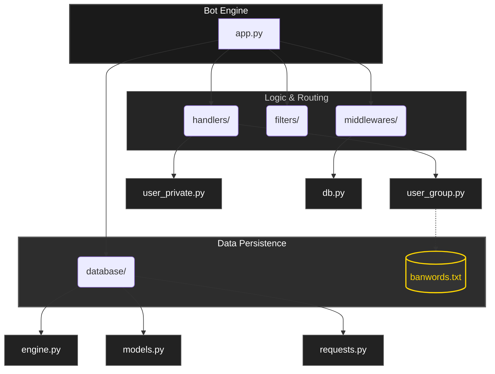

# 🛡️ Telegram Profanity Filter & Moderation Bot

<p align="center">
  <a href="https://git.io/typing-svg">
    
  </a>
</p>

<p align="center">
  
  
  
  
</p>

---

<p align="center">
  
</p>

A professional **Telegram moderation tool** built with **Python** and **Aiogram 3**. This bot provides **automatic profanity filtering**, anti-spam protection, and advanced administrative tools to keep your group chats clean and safe.

---

## 🚀 Tech Stack

<p align="left">
  
  
  
  
</p>

---

## ✨ Key Features

- **🛡️ Join Captcha**: Automated anti-bot verification for new members with timed auto-kick.
- **🚀 Automated Moderation**: Real-time scanning of messages and edits for prohibited keywords.
- **💾 Persistent Storage**: SQLite database powered by **SQLAlchemy 2.0** to track violation history.
- **⚠️ Smart Warning System**: Automatically issues warnings to violators (3/3 warnings lead to auto-mute).
- **📈 Progressive Mutes**: Intelligent restriction system that scales based on history.
- **🛠️ Admin Toolkit**: Manual `/warn`, `/mute`, and `/ban` commands with custom durations.
- **🛡️ Admin Immunity**: Full recognition and protection for group administrators.

---

## 📋 Available Commands

### 👤 Private Chat
- `/start` — Start the bot and get an overview.
- `/help` — Detailed guide on how to use the bot.
- `/about` — Information about the bot's features and technical stack.
- `/how_use_bot` — Step-by-step setup instructions.

### 👥 Group Moderation (Admin Only)
- `/warn` — Issue a formal warning (Reply required).
- `/mute [duration/ID] [set]` — Mute a user (Reply or User ID).
- `/unmute` — Restore message permissions (Reply required).
- `/ban [duration/ID] [set]` — Ban a user from the group (Reply or User ID).
- `/unban [ID]` — Lift a ban (Reply or User ID).

> **💡 Time Formats:** `10m`, `1h`, `1d`, `1w`, or `permanent`.

---

## 🏗️ Project Architecture



---

## 📂 File Structure

```text
📦 Telegram-Moderation-Bot
 ┣ 📂 database          # SQLAlchemy 2.0 models & async requests
 ┣ 📂 filters           # Custom logic gates for messages
 ┣ 📂 handlers          # The brain of the bot (Group & Private)
 ┣ 📂 middlewares       # Database session injection
 ┣ 📜 app.py            # Main entry point & polling
 ┗ 📜 bot_cmd_list.py   # Command menu configuration
```

---

## 🚀 Quick Start

1. **Add the Bot** to your Telegram group.
2. **Promote to Admin** with the following permissions:
   - 🗑️ **Delete Messages**
   - 🚫 **Ban Users**
3. **Upgrade to Supergroup**: Ensure your chat is a supergroup to enable restriction features.

---

## ⚙️ Installation

1. **Clone & Enter**:
   ```bash
   git clone https://github.com/kapusta123b/Telegram-Moderation-Bot
   cd Telegram-Moderation-Bot
   ```
2. **Install**:
   ```bash
   pip install -r requirements.txt
   ```
3. **Configure**:
   Add your token in .env file:
   ```env
   SECRET_KEY=your_bot_token
   ```
4. **Launch**:
   ```bash
   python app.py
   ```

---

## ⚠️ Important Note

This bot uses a keyword-matching system. To ensure the best performance for your community, regularly update the `handlers/banwords.txt` file with words specific to your moderation needs.

---

## 🤝 Support & Connect

<p align="center">
  <a href="https://t.me/kapusta123b">
    
  </a>
  <a href="https://github.com/kapusta123b/Telegram-Moderation-Bot/stargazers">
    
  </a>
</p>

---

<p align="center">
  
</p>

<p align="center">
  <sub>Made with ❤️ for clean communities</sub>
</p>
