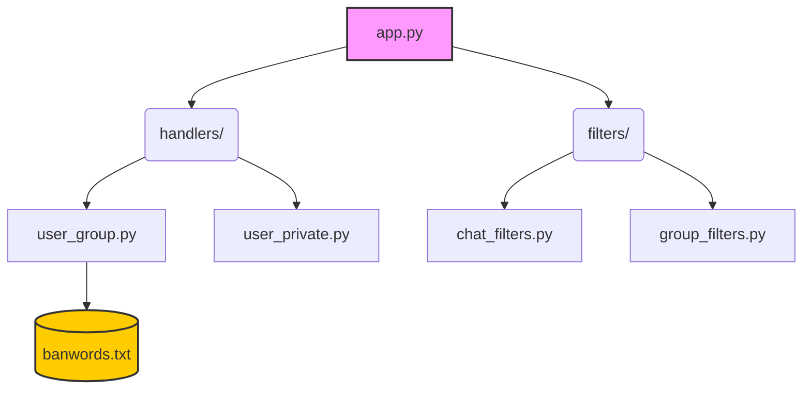

# 🛡️ Telegram Profanity Filter & Moderation Bot

A professional **Telegram moderation tool** built with **Python** and **Aiogram 3**. This bot provides **automatic profanity filtering**, anti-spam protection, and advanced administrative tools to keep your group chats clean and safe.

---

## ✨ Key Features

- **🚀 Automated Moderation**: Real-time scanning of messages and edits for prohibited keywords.
- **⚠️ Smart Warning System**: Automatically issues warnings to violators (3/3 limit).
- **⏳ Auto-Restriction**: Automatically mutes repeat offenders for 1 hour.
- **🛠️ Admin Toolkit**: Manual `/mute` and `/ban` commands with custom durations.
- **🛡️ Admin Immunity**: Full recognition and protection for group administrators.

---

## 📋 Available Commands

### 👤 Private Chat
- `/start` — Start the bot and get an overview.
- `/help` — Detailed guide on how to use the bot.
- `/about` — Information about the bot's mission.

### 👥 Group Moderation (Admin Only)
- `/mute [duration/ID] [set]` — Mute a user (Reply to message or use User ID).
- `/unmute` — Restore message permissions (Reply to their message).
- `/ban [duration/ID] [set]` — Ban a user from the group (Reply to message or use User ID).
- `/unban [ID]` — Lift a ban (Use numeric User ID or reply).

> **💡 Time Formats:** `10m`, `1h`, `1d`, `1w`, or `permanent`.
> **🛠️ The 'set' Argument:** Use `set` to update or extend the duration for a user who is already restricted (e.g., `/mute 1h set`).

---

## 🏗️ Project Architecture



```text
📦 tg_profanity_bot
 ┣ 📂 filters           # Custom logic gates for messages
 ┃ ┣ 📜 chat_filters.py # Private vs Group detection
 ┃ ┗ 📜 group_filters.py # Admin & Permission checks
 ┣ 📂 handlers          # The brain of the bot
 ┃ ┣ 📜 user_group.py   # Automated & Manual moderation
 ┃ ┣ 📜 user_private.py # Interaction & Help system
 ┃ ┗ 📜 banwords.txt    # Prohibited keywords database
 ┣ 📜 app.py            # Main entry point & polling
 ┗ 📜 bot_cmd_list.py   # Command menu configuration
```

---

1. **Add the Bot** to your Telegram group.
2. **Promote to Admin** with the following permissions:
   - 🗑️ **Delete Messages**
   - 🚫 **Ban Users**
3. **Upgrade to Supergroup**: Ensure your chat is a supergroup to enable restriction features.

---

## ⚙️ Installation

1. **Clone & Enter**:
   ```bash
   git clone <repository_url>
   cd tg_profanity_bot
   ```
2. **Install**:
   ```bash
   pip install -r requirements.txt
   ```
3. **Configure**:
   Add your token in .env file and add .env to gitignore:
   ```env
   SECRET_KEY=your_bot_token
   ```
4. **Launch**:
   ```bash
   python app.py
   ```

---

## ⚠️ Important Note

This bot uses a keyword-matching system. To ensure the best performance for your community, regularly update the `handlers/banwords.txt` file with words specific to your moderation needs.

---
