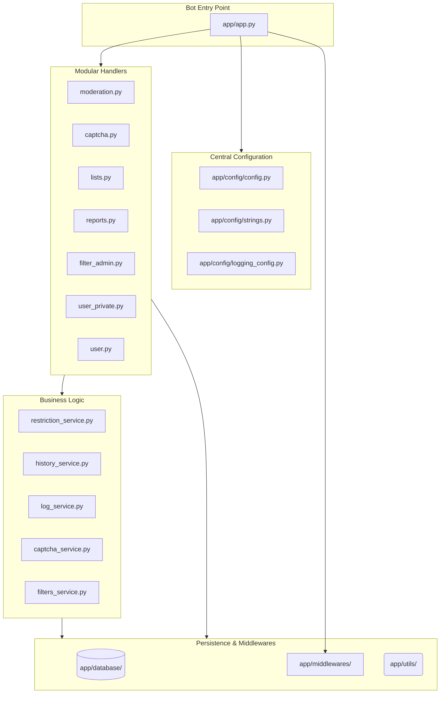

# 🛡️ Telegram Profanity Filter & Moderation Bot

<p align="center">
  
  
  
  
</p>

---

<p align="center">
  
</p>

A professional **Telegram moderation tool** built with **Python** and **Aiogram 3**. This bot provides **automatic profanity filtering**, anti-spam protection, and advanced administrative tools to keep your group chats clean and safe. Fully containerized with **Docker Compose**.

---

## 🚀 Tech Stack

<p align="center">
  
  
  
  
  
</p>

---

## ✨ Key Features

- **🛡️ Join Captcha**: Automated anti-bot verification for new members.
- **🚀 Automated Moderation**: Real-time scanning for prohibited keywords and external links.
- **🚫 Anti-Advertising**: Automatically detects and removes Telegram invitation links.
- **📊 User Statistics**: Track mutes, bans, warning history, and message count.
- **📜 Moderation Logs**: Dedicated channel logging for all administrative actions.
- **🔧 Modular Architecture**: Decoupled handlers and services for high maintainability.
- **⚠️ Smart Warning System**: Configurable warning limits (default: 5) leading to auto-mutes.
- **📈 Progressive Mutes**: Restriction durations that scale based on violation history.
- **🛠️ Admin Toolkit**: Comprehensive commands for manual moderation and filter management.

---

## 🏗️ Project Architecture



---

## 📂 File Structure

```text
📦 Telegram-Moderation-Bot
 ┣ 📂 app
 ┃ ┣ 📂 config             # Configuration, strings, and logging setup
 ┃ ┣ 📂 database           # SQLAlchemy models, SQLite, and banwords
 ┃ ┣ 📂 filters            # Admin validation and chat-type filters
 ┃ ┣ 📂 handlers           # Modular routers (Moderation, Captcha, Filters, etc.)
 ┃ ┣ 📂 middlewares        # DB session and Statistics middlewares
 ┃ ┣ 📂 services           # Core business logic (Restrictions, History, Filters)
 ┃ ┣ 📂 utils              # Helper functions (Time parsing, Text normalization)
 ┃ ┣ 📜 app.py             # Main entry point & dispatcher configuration
 ┃ ┣ 📜 requirements.txt   # Project dependencies
 ┃ ┗ 📜 .env               # Environment variables
 ┣ 📜 docker-compose.yml     # Docker orchestration
 ┗ 📜 LICENSE                # MIT License
```

---

## 📋 Available Commands

### 👤 Private Chat
- `/start` — Start the bot and get an overview.
- `/help` — Detailed guide on how to use commands.
- `/stats` — View your personal statistics.
- `/about` — Technical information about the bot.
- `/how_use_bot` — Step-by-step setup instructions.

### 👥 Group Moderation (Admin Only)
- `/set_admin_chat` — Configure current chat for admin logs.
- `/unset_admin_chat` — Disable admin logging for current chat.
- `/warn` — Issue a warning (Reply required).
- `/unwarn` — Remove one warning (Reply required).
- `/mute [duration/ID] [set] [reason]` — Mute a user.
- `/unmute [ID]` — Lift a mute.
- `/ban [duration/ID] [set] [reason]` — Ban a user.
- `/unban [ID]` — Lift a ban.
- `/addfilter [word]` — Add a word to the profanity filter.
- `/removefilter [word]` — Remove a word from the filter.
- `/mute_list [current]` — View mute history.
- `/ban_list [current]` — View ban history.
- `/warn_list` — View warning history.

### 🛡️ Public Group Commands
- `/report` — Report a message to admins (Reply required).
- `/stats` — View your stats in the current chat.

---

## ⚙️ Installation & Setup

### 🐳 Method 1: Docker (Recommended)
1. **Clone the repository**:
   ```bash
   git clone https://github.com/kapusta123b/Telegram-Moderation-Bot
   cd Telegram-Moderation-Bot
   ```
2. **Configure environment**:
   Create `app/.env` and add your token:
   ```env
   BOT_TOKEN=your_bot_token_here
   ```
3. **Launch with Docker Compose**:
   ```bash
   docker-compose up -d --build
   ```

### 🐍 Method 2: Manual Installation
1. **Clone the repository**:
   ```bash
   git clone https://github.com/kapusta123b/Telegram-Moderation-Bot
   cd Telegram-Moderation-Bot
   ```
2. **Install dependencies**:
   ```bash
   pip install -r app/requirements.txt
   ```
3. **Configure environment**:
   Create `app/.env`:
   ```env
   BOT_TOKEN=your_bot_token_here
   ```
4. **Run the bot**:
   ```bash
   cd app
   python app.py
   ```

---

## ⚠️ Important Note

This bot uses a keyword-matching system. You can manage the filter list directly using `/addfilter` and `/removefilter` commands in your group, or by manually editing `app/database/banwords.txt`.

---

## 🤝 Connect

<p align="center">
  <a href="https://t.me/kapusta123b">
    
  </a>
  <a href="mailto:fartuchoknik22@gmail.com">
    
  </a>
</p>

---

<p align="center">
  
</p>

<p align="center">
  <sub>Made with ❤️ for clean communities</sub>
</p>
